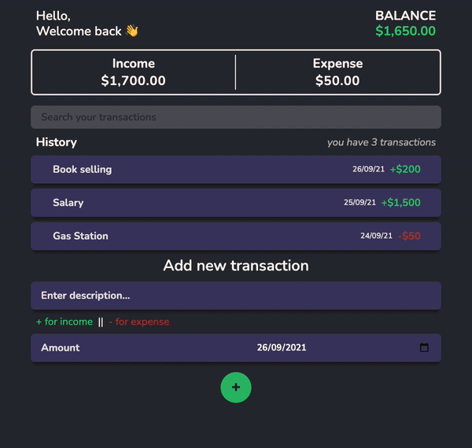

# Wallet Alkemy

This is an expense tracker App created for the [Alkemy Labs](https://www.alkemy.org/) challenge.



You can see the live demo [here](https://alkemy-wallet.herokuapp.com/).

In order to try it from the **live demo**, you will only need to start the local server locally. [Follow the instructions here]('').

**To play with the project locally, keep reading below.**

## Usage

```
change .env file
```

```
npm install
cd client npm install
cd ..

# Run Front and Backend
npm run dev

# Backend only
npm run server

# Frontend only
cd client
npm run start

# Build
cd client
npm run build
```
