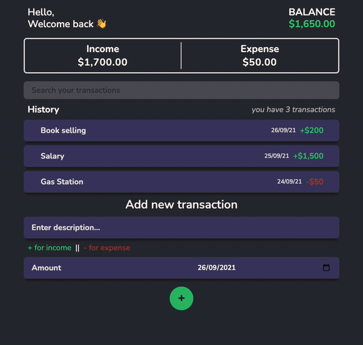

# wallet-alkemy

This is an expense tracker App created for the [Alkemy Labs](https://www.alkemy.org/) challenge.

It uses Node.js with Express.js, connected to a PostgreSQL database. The client side was built with React.



## Usage

```
npm install
# Run on http://localhost:3000

# Run client and server side
npm run dev

# Run the server
npm run server
```

```
# Builds the app for production to the "build" folder.
npm run build
```
